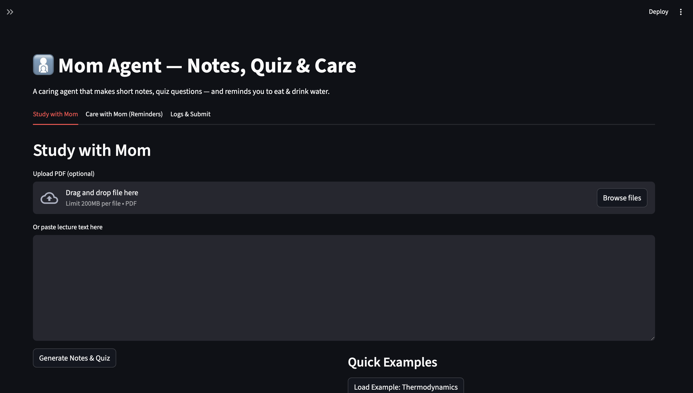
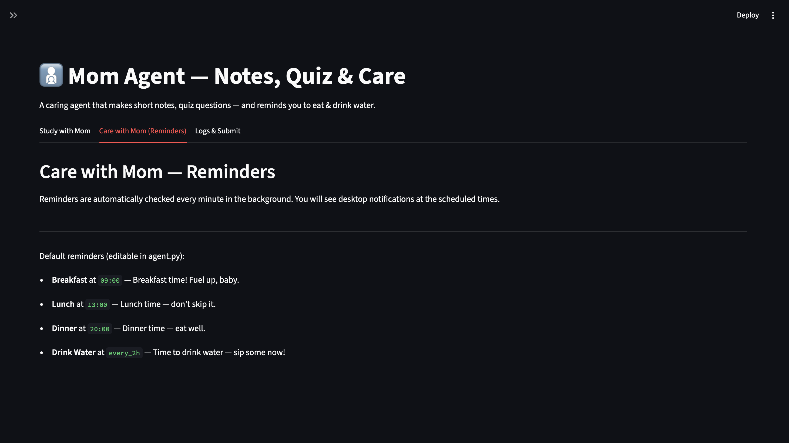
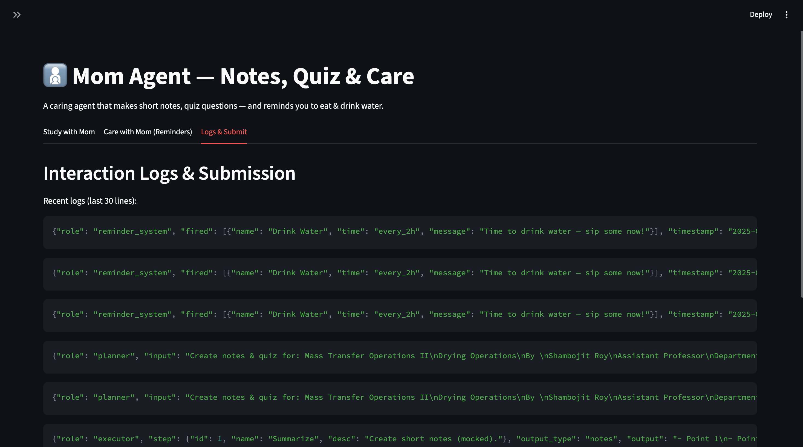

# 👩‍👧 Mom Agent — AI Study & Wellness Companion

**Author:** Adyasa Mohapatra  
**University:** IIT Guwahati  
**Department:** Chemical Engineering  

---

## **About the Project**
Mom Agent is a persona-driven AI assistant designed to help students like me **study efficiently** while also making sure we **take care of our basic well-being**, just like a caring mom would.  

It combines **learning assistance** and **wellness reminders** in one interactive AI agent, so you can focus on your studies without forgetting to eat, drink water, or take small breaks.  

---

## **Core Features**
1. **Study Assistance**  
   - Generates **concise lecture notes** (5 bullet points) from pasted text or PDFs.  
   - Generates **5 short quiz questions** with answers to test your understanding.  
   - Planner + Executor multi-agent architecture ensures stepwise reasoning and execution.  

2. **Wellness Reminders**  
   - Scheduled reminders for meals and drinking water.  
   - Desktop notifications mimic a caring mom checking in on you.  

3. **Interactive UI**  
   - Built using **Streamlit** for an easy-to-use web interface.  
   - Sections for study, care reminders, logs, and GitHub submission.  

4. **Interaction Logs**  
   - All AI prompts and outputs are logged in **`logs.txt`** for reproducibility and evaluation.  

---

## **Tech Stack**
- **Python 3.9+**  
- **Streamlit** — web UI  
- **OpenAI GPT** — text generation (notes, quizzes, conversational responses)  
- **PyPDF2** — PDF text extraction  
- **Plyer** — desktop notifications  

---

## **How to Run (Demo)**
1. Clone this repository:  
   ```bash
   git clone https://github.com/yourusername/mom-agent.git
   cd mom-agent
2. Create a virtual environment and activate it:
   ```bash
   python3 -m venv venv
   source venv/bin/activate  
3. Install dependencies:
   ```bash
   pip install -r requirements.txt
4. Set your OpenAI API key:
   ```bash
   export OPENAI_API_KEY="sk-..."
5. Run the app:
   ```bash
   streamlit run app.py

## Future Prospects
Mom Agent is already helpful, but there’s room to make it **even more motherly, interactive, and supportive**:

- **More Motherly Responses:** Enhance the tone to be warmer, encouraging, and empathetic.  
- **Feedback Section:** Allow students to rate notes/quizzes and get personalized guidance.  
- **Therapist Section:** A conversational section where students can talk to “Mom” like a friendly listener or coach.  
- **RAG Integration:** Pull content from textbooks, slides, or external sources to make notes more comprehensive.  
- **Mobile App Version:** For on-the-go reminders and study assistance.  
- **Advanced Scheduling:** Background scheduling with push notifications for all reminders.  

## Deliverables
- `agent.py` — core multi-agent logic  
- `app.py` — Streamlit UI  
- `design_doc.md` — system design document  
- `README.md` — this file  
- `logs.txt` — JSONL interaction logs

## Screenshots
Here are some demo screenshots of the Mom Agent in action:

### 1. Study Tab


### 2. Reminders Tab


### 3. Logs & Submission Tab

